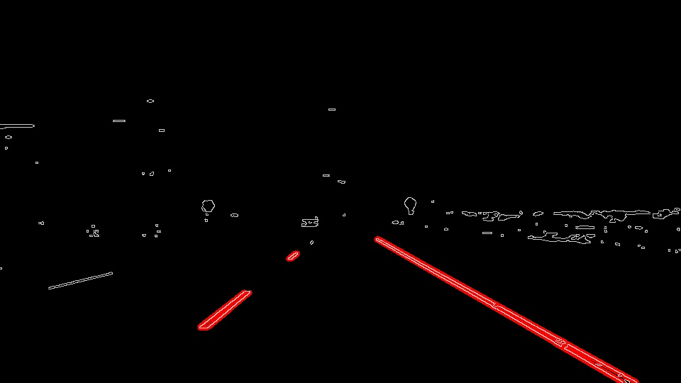
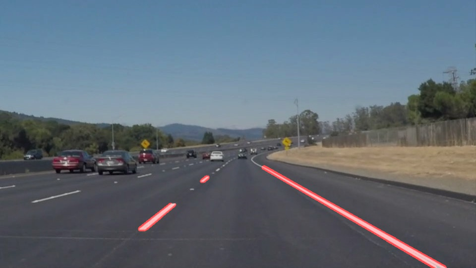
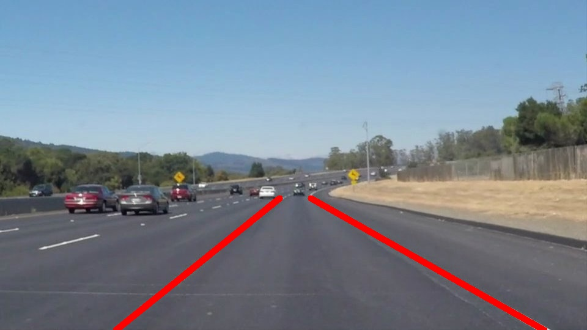

#**Finding Lane Lines on the Road** 

In this project, I used Python3 and OpenCV to find lane lines in the road images. The following techniques were used:

* Color Selection
* Gaussian Smoothing
* Canny Edge Detection
* Region of Interest Selection
* Hough Transform Line Detection
* Line Extrapolation

## Color Selection
The images from RGB to HLS color space as yellow and white colors were clearly recognizable.
* Use cv2.inRange to filter the white color and the yellow color seperately.
* Use cv2.bitwise_or to combine these two binary masks.
* Use cv2.bitwise_and to apply the combined mask onto the original RGB image

```
def select_rgb_white_yellow(image): 
    hls_image = cv2.cvtColor(image, cv2.COLOR_RGB2HLS)

    white_mask = cv2.inRange(hls_image, np.uint8([20,200,0]), np.uint8([255,255,255])) 
    yellow_mask = cv2.inRange(hls_image, np.uint8([10,50,100]), np.uint8([100,255,255]))

    # combine the mask
    mask = cv2.bitwise_or(white_mask, yellow_mask)
    masked = cv2.bitwise_and(image, image, mask = mask)
    return masked
```
     
## Gaussian Smoothing
cv2.GaussianBlur is used to smooth out rough edges. The GaussianBlur takes a kernel_size parameter which needs to be selected appropriately. 

```
def gaussian_blur(img, kernel_size):
    """Applies a Gaussian Noise kernel"""
    return cv2.GaussianBlur(img, (kernel_size, kernel_size), 0)
```

## Canny Edge Detection
cv2.Canny takes two threshold values that are defined by trial and error. Canny recommended a upper:lower ratio between 2:1 and 3:1.

```
def canny(img, low_threshold, high_threshold):
    """Applies the Canny transform"""
    return cv2.Canny(img, low_threshold, high_threshold)
```    

## Region of Interest Selection
The image mask is applied to only the region defined by the polygon formed from the vertices. The rest of the image is set to black.

```
def region_of_interest(img, vertices):
    #defining a blank mask to start with
    mask = np.zeros_like(img)   
    
    #defining a 3 channel or 1 channel color to fill the mask with depending on the input image
    if len(img.shape) > 2:
        channel_count = img.shape[2]  # i.e. 3 or 4 depending on your image
        ignore_mask_color = (255,) * channel_count
    else:
        ignore_mask_color = 255
    
    #filling pixels inside the polygon defined by "vertices" with the fill color    
    cv2.fillPoly(mask, vertices, ignore_mask_color)
    
    #returning the image only where mask pixels are nonzero
    masked_image = cv2.bitwise_and(img, mask)
    return masked_image
```

## Hough Transform Line Detection
cv2.HoughLinesP is used to detect lines in the edge images.

The following parameters need to be adjusted accordingly:

* rho: distance resolution in pixels of the Hough grid
* theta: angular resolution in radians of the Hough grid
* threshold: minimum number of votes (intersections in Hough grid cell)
* min_line_len: minimum number of pixels making up a line
* max_line_gap: maximum gap in pixels between connectable line segments




## Line Extrapolation
We have lane lines: one for the left and the other for the right. The left lane has a positive slope, and the right lane has a negative slope. We find the average of the left and right slopes and intercepts to get an average of the lanes. Calculate the weighted average of the slopes and intercepts based on the length of the line segment.

```
def avg_slope_intercept(lines):
    left_lines = np.empty([1,3])
    right_lines = np.empty([1,3])
    
    for line in lines:
        for x1,y1,x2,y2 in line:
            if x1==x2:
                continue
            slope = get_slope(x1,y1,x2,y2)
            intercept = y1 - (slope*x1)
            line_length = np.sqrt((y2-y1)**2+(x2-x1)**2)
            # array of slopes, intercepts and line lengths
            if slope < 0:
                left_lines = np.append(left_lines, np.array([[slope, intercept, line_length]]), axis=0)
            else:
                right_lines = np.append(right_lines, np.array([[slope, intercept, line_length]]), axis=0)
                
    # lines with values within 2 standard deviations
    left_lines = left_lines[slope_idx_close_to_avg(left_lines[:,0])]
    
    right_lines = right_lines[slope_idx_close_to_avg(right_lines[:,0])]

    # weighted avg of slopes and intercepts based on line length
    if len(left_lines[1:,2]) > 0:
        left_lane = np.dot(left_lines[1:,2],left_lines[1:,:2])/np.sum(left_lines[1:,2])
    else:
        left_lane = None

    if len(right_lines[1:,2]) > 0:
        right_lane = np.dot(right_lines[1:,2],right_lines[1:,:2])/np.sum(right_lines[1:,2])
    else:
        right_lane = None

    return left_lane, right_lane
```

The average is quite sensitive to outliers. So adjust for the outliers by removing points that were greater than 1.5 standard deviations from the rest of the slopes.

```
# remove outliers
def slope_idx_close_to_avg(s, dev=1.5):
    return np.array(abs(s - np.mean(s)) < dev*np.std(s))
```
To draw the lanes, convert the slope and intercept into pixel points.

```
def get_endpoints_from_m_b(y1, y2, line):
    if line is not None:
        m, b = line

        x1 = int((y1-b)/m)
        x2 = int((y2-b)/m)
        y1 = int(y1)
        y2 = int(y2)

        return ((x1, y1), (x2, y2))
    else:
        return None
```

draw_lane_lines() accepts a list of lines as a parameter. Each line is a list of 4 values (x1, y1, x2, y2).

```
def draw_lane_lines(img, lines):
    line_img = np.zeros_like(img)
    for line in lines:
        if line is not None:
            cv2.line(img, line[0], line[1], [255, 0, 0], 10)
    return cv2.addWeighted(img, 1.0, line_img, 0.95, 0.0)
```

For having multiple images in a single cell, we use the following:

```
import PIL
from glob import glob

# Load a collection of image files with PIL
images = [ PIL.Image.open(f) for f in glob('test_images/solidYellowLeft_Output*') ]

np_images = [ img2array(im) for im in images ]

# For multiple figures in one cell, just call plt.figure() for each new figure
for img in np_images:
    plt.figure()
    plt.imshow(img)
```



## Applying Lane Finding to Video Clips
We use the above method of identifying and marking the lane lines within the image supplied on a video, which is just a sequence of images. This is defined in the following process_image() method:

```
def process_image(img):
    # NOTE: The output you return should be a color image (3 channel) for processing video below
    # TODO: put your pipeline here,
    # you should return the final output (image where lines are drawn on lanes)

    # selecting yellow and white colors
    image = select_rgb_white_yellow(img)
    gray = grayscale(image)
    # define kernel and apply gaussian smoothing
    blur_gray = gaussian_blur(gray, 15)
    # Define our parameters for Canny and apply
    edges = canny(blur_gray, 50, 150)

    # This time we are defining a four sided polygon to mask
    imshape = image.shape
    bottom_left  = [imshape[1]*0.1, imshape[0]]
    top_left     = [imshape[1]*0.45, imshape[0]*0.6]
    bottom_right = [imshape[1]*0.95, imshape[0]]
    top_right    = [imshape[1]*0.6, imshape[0]*0.6] 
    vertices = np.array([[bottom_left, top_left, top_right, bottom_right]], dtype=np.int32)
    masked_edges = region_of_interest(edges, vertices)

    # apply hough trasnformation with folowing Hough transform parameters
    rho = 1
    theta = np.pi/180
    threshold = 20
    min_line_length = 20
    max_line_gap = 300

    lines = hough_lines2(masked_edges, rho, theta, threshold, min_line_length, max_line_gap)

    # draw extrapolated lines on the original image
    if lines is not None:
        # find the endpoints given the slopes and intercepts
        left, right = get_endpoints(img, lines)
        # normal arithmetic average of previously fitted lines
        left = mean_lines(left)
        right = mean_lines(right)
        # generate lane lines
        draw_lane_lines(img, (left, right))
    
    return img
```    

## Conclusion
The above solution works well for straight roads. But it may now work well for curved roads and lanes marked with different colors than yellow or white. Also it may not work well for steep roads.
